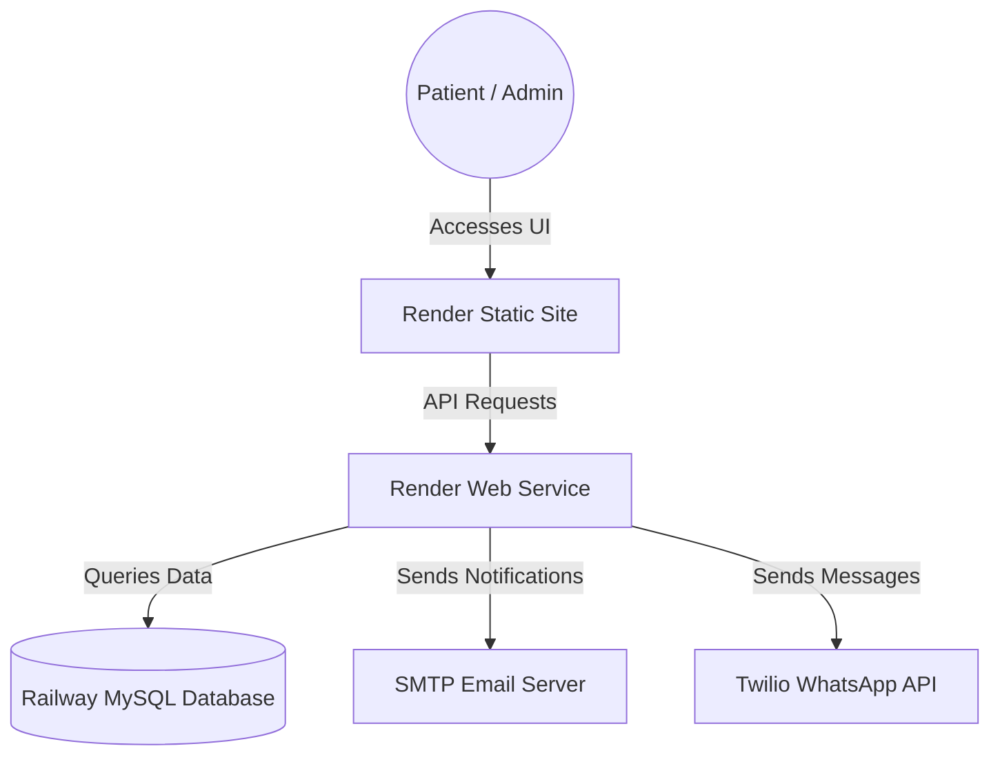

# Production Deployment Manual — Ayurda Clinics

This guide details the step-by-step process of deploying the **Ayurda Clinics** website in a production environment using **Railway** for the MySQL database and **Render** for the frontend and backend services.

---

## Deployment Architecture

---

## Step 1: Create Railway MySQL Database

1. Log in to [Railway.app](https://railway.app).
2. Click **New Project** → **Provision MySQL**.
3. Railway will spin up a fresh, managed MySQL database.
4. Go to the **Variables** tab of the MySQL service and copy the auto-generated connection parameters:
   * `MYSQLHOST`
   * `MYSQLPORT`
   * `MYSQLUSER`
   * `MYSQLPASSWORD`
   * `MYSQLDATABASE`

---

## Step 2: Configure Railway Environment Variables
*(Optional)* If you wish to set up custom database credentials, you can modify the keys in the Railway service **Variables** dashboard. However, the backend is built to auto-detect Railway's standard `MYSQL*` values, so the default configuration is recommended.

---

## Step 3: Deploy Backend to Render

1. Log in to [Render.com](https://render.com).
2. Click **New** → **Blueprint** to import via the `render.yaml` specification, OR deploy manually:
   * Select **Web Service**.
   * Link your Git repository.
   * Configure settings:
     * **Name**: `ayurda-clinics-backend`
     * **Root Directory**: `backend`
     * **Build Command**: `npm install`
     * **Start Command**: `npm start`
     * **Instance Type**: Free (or higher)

---

## Step 4: Configure Backend Environment Variables

In your Render Backend Web Service settings, go to the **Environment** tab and add the following environment variables:

| Key | Value / Source | Description |
|---|---|---|
| `PORT` | `5001` | Server listening port |
| `DB_HOST` | *(From Railway `MYSQLHOST`)* | Database Host URL |
| `DB_PORT` | *(From Railway `MYSQLPORT`)* | Database Port |
| `DB_USER` | *(From Railway `MYSQLUSER`)* | Database User |
| `DB_PASSWORD` | *(From Railway `MYSQLPASSWORD`)* | Database Password |
| `DB_NAME` | *(From Railway `MYSQLDATABASE`)* | Database Name |
| `JWT_SECRET` | *(Choose a secure random string)* | Secret for JWT authentication |
| `SMTP_HOST` | `smtp.gmail.com` | SMTP Server Host |
| `SMTP_PORT` | `587` | SMTP Server Port |
| `SMTP_USER` | `rajakumarsoni91288@gmail.com` | Gmail account for notifications |
| `SMTP_PASS` | `aymjgrwtltmqlpjo` | Gmail App Password |
| `ADMIN_EMAIL` | `rajakumarsoni91288@gmail.com` | Admin email for booking alerts |
| `CLINIC_NAME` | `Ayurda Clinics` | Clinic branding name |
| `CLINIC_PHONE` | `+91-98765-43210` | Clinic contact phone |
| `FRONTEND_URL` | `https://your-frontend-app.onrender.com` | Production URL of the frontend |

> [!NOTE]
> **Database Migrations are Automatic**
> Once the backend successfully connects to the Railway MySQL database, it will automatically run the schema migration and insert initial seeds for Doctors, Services, FAQs, and Testimonials! No manual `.sql` import is required.

---

## Step 5: Deploy Frontend to Render

1. Log in to [Render.com](https://render.com).
2. Click **New** → **Static Site**.
3. Link your Git repository.
4. Configure settings:
   * **Name**: `ayurda-clinics-frontend`
   * **Root Directory**: `frontend`
   * **Build Command**: `npm run build` (which runs `vite build`)
   * **Publish Directory**: `dist`

---

## Step 6: Configure Frontend Environment Variables (VITE_API_URL)

In your Render Frontend Static Site settings, go to the **Environment** tab and add:

| Key | Value | Description |
|---|---|---|
| `VITE_API_URL` | `https://your-backend-app.onrender.com/api` | The public URL of your Render backend |
| `VITE_BACKEND_URL` | `https://your-backend-app.onrender.com` | Root URL of backend (for resolving doctor image paths) |

---

## Step 7: Verify Production Flow

Once both frontend and backend are successfully deployed, execute these verification checks:

1. **User Registration & Login**: Go to `/register`, create an account, check that welcome email notification is sent, and login successfully at `/login`.
2. **Appointment Booking**: Navigate to `/book-appointment`, book an inquiry, perform simulation checkout, and verify email confirmation.
3. **Admin Dashboard Access**:
   * Navigate to `/admin/login`.
   * Log in using default credentials (email `admin@ayurda.com` with password `password`).
   * Confirm you are redirected to `/admin/dashboard`.
4. **CRUD Actions**: Test adding/editing/deleting a Doctor, Service, Testimony, and FAQ inside the admin panel. Verify persistence on page refreshes.
5. **Doctor Image Uploads**: Add a new doctor with a custom profile image. Check that the image is loaded correctly on the frontend `/doctors` profile list.
6. **SPA Routing Refresh**: Navigate to `/admin/users` or `/doctors` and hit refresh in the browser. Verify the page reloads successfully instead of throwing a `404 Not Found` error.
